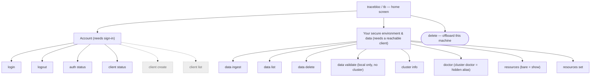
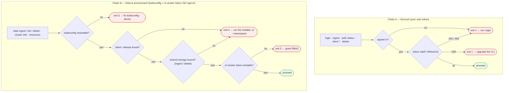
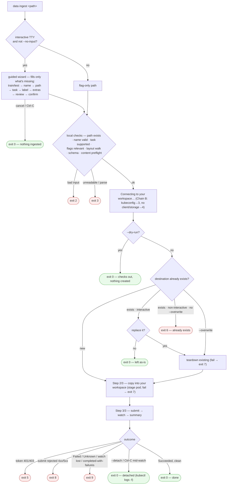
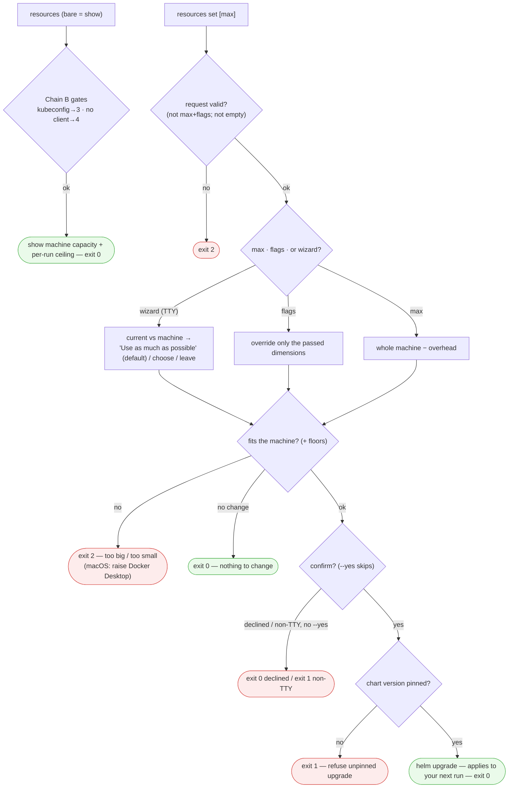

# tracebloc CLI — navigation map

**The single source of truth for how a user moves through the CLI.** Every command, decision point, and place a user can end up. Diagrams are [Mermaid](https://mermaid.js.org) — they render natively on GitHub and in the docs, and this file is version-controlled, so **edit this file + open a PR to change the map** (that PR is where we discuss flow changes).

The map tracks `develop`. Everything drawn solid is shipped there — including `resources show` (#237), `resources set` (#241), and the status-aware home screen (#244).

**How to read it:** `{diamond}` = decision · `[box]` = step · `([rounded])` = where you end up · green = exit 0 · red = non-zero exit · grey dashed = hidden (installer/back-compat).

---

## 1. Top-level map — what's reachable from `tracebloc` / `tb`

`tb` is a convenience alias for `tracebloc` (installer-placed symlink; identical behavior). Aliases kept one deprecation cycle: `data`↔`dataset`, `data ingest`↔`push`, `data delete`↔`rm`. Hidden nodes are fully functional but off the everyday surface (installer / back-compat).

---

## 2. The two gate chains — the key structural fact

Commands split into **two independent families** that authenticate differently. Account commands need you signed in (a user token). Data / environment commands are **auth-free w.r.t. your login** — they reach the cluster via kubeconfig RBAC and mint an in-cluster token. Only `client create` and `delete` cross both.

---

## 3. `data ingest` — the core flow

The wizard fills only what flags left empty; off a TTY (or `--no-input` / `--output-json`) every gap becomes a hard error instead of a prompt.

> Note: exit codes are **not** monotonic in execution order — staging (exit 7) runs *before* the token mint (exit 5). The diagram shows the true order.

---

## 4. `resources` — show & set  *(both shipped on `develop`: `show` #237, `set` #241)*

---

## Exit codes

| code | meaning |
|---|---|
| 0 | success (incl. dry-run, detached, "nothing to change", declined-safely) |
| 1 | generic / account-auth (not signed in, token rejected, upgrade required) |
| 2 | bad input / schema violation / doesn't fit |
| 3 | kubeconfig unreachable, or a local file/parse error |
| 4 | cluster reached but no tracebloc client / storage |
| 5 | in-cluster token could not be minted (RBAC) |
| 6 | destination dataset already exists |
| 7 | staging / teardown failed |
| 8 | jobs-manager rejected the submit |
| 9 | ingestion Job failed / partial-failure / watch error |
| 130 | Ctrl-C |

## Cross-links — where a dead-end points

- **not signed in / token 401·403** → `login`
- **426 upgrade-required** → upgrade the CLI
- **kubeconfig (exit 3)** → fix `--kubeconfig`/`--context`, then `doctor`
- **no client / environment (exit 4)** → run the installer (or `--namespace`); triage with `doctor`
- **no token (exit 5)** → grant RBAC; diagnose with `cluster info` / `doctor`
- **destination exists (exit 6)** → `--overwrite`, a different `--name`, or `data delete` first
- **staging partial (exit 7)** → `data delete` then re-ingest
- **ingest failed (exit 9)** → the panel / `kubectl get job` / `kubectl logs -f`
- **no active client** (client status / delete) → `client create` / re-run installer

## Known gaps / decisions (raise in review)

1. **`delete` (offboard) exits 0 even on a *partial/degraded* teardown** — it warns but never returns non-zero, so a script can't detect an incomplete offboard. A dedicated non-zero "partial offboard" code would close this.
2. **`cluster info`'s home is open** — the `doctor` promotion shipped (top-level `doctor`, with `cluster doctor` kept as a hidden alias); whether `cluster info` stays under `cluster` or is also promoted is undecided.
3. Terminology in the live copy (client / cluster / `<table>`) is pre-cleanup; the map uses the agreed target words (secure environment, etc.). The rename wave aligns the code later.

Resolved since the first cut of this map: the status-aware home screen shipped ([#244](https://github.com/tracebloc/cli/pull/244) — greeting + sign-in + environment state on bare `tracebloc`/`tb`), and `resources set` shipped ([#241](https://github.com/tracebloc/cli/pull/241)).
